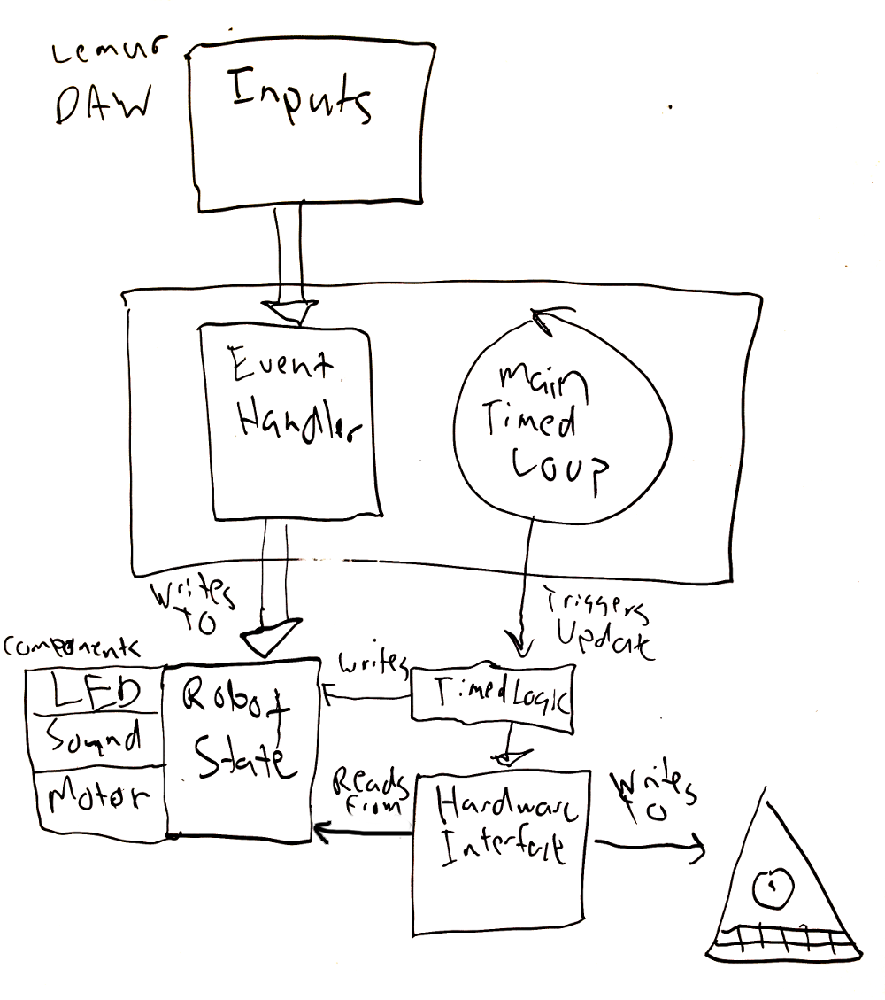

# Melodyian Arduino Code

Pro Mini 3.3 =- 328

Get FTDI Drivers
http://www.ftdichip.com/FTDrivers.htm

https://learn.sparkfun.com/tutorials/how-to-install-ftdi-drivers/mac#yosemite

## Melodyian Architecture

### Rough Architectural vision

When first starting the Melodyian, we run a setup function that initializes the hardware, a class that represents the internals of the Robot's state (such as LED colors, motor inputs, what notes to play), and set up a mapping between input events to a set of single-purpose functions that handle updating the Robot's state based on input values.

After the setup phase, when the Robot is running, we concurrently run two loops:

* An event loop that runs in the background, accepting inputs and updating the Robot's state
* A main loop that triggers on a regular basis, that processes any timed actions, and takes the Robot's internal state that we've stored and updated based on events and translates that to the hardware interface (to actuate the robot, change the LED colors, play sounds, etc.)

In this vision: 

* When each event that gets triggered (I.E. a MIDI note or control change), we consult a table that links from the particular event to the function that should be called to react to that event. Each function should contain only the logic necessary to update the Robot's state based on that input. In this way, we isolate the behavior changes based on each input.
* The class representing the Robot's state provides an abstraction layer over any particular hardware. Input events should only ever write to this state, they should never directly write to hardware.
* When we update the robot hardware, we always read from only the Robot state. All information about what the Robot should be a combination of what is stored in this state, and any timed actions we have set up.

### Running The Melodyian

During Setup, we:

* Initialize Hardware and Robot State
* Set up Event Listener

When we run, we:

- Run an event loop that listens for input, and routes inputs to the functions that process the input. 
    - In the current robot, events are handled by the MIDI interface
    - We trigger responses to events by looking up the mapping from input to response in the ControlChangeHandler. In the future, this should have a full set of atomic mappings between inputs (MIDI notes) and changes to the robot's state. Right now, this is only implemented for a few bits of functionality -- most of the processing of the events is still done in the large process[LED/Motor/Sound]CC and note[On/Off]Control functions.
- Run a main loop that once every X milliseconds -- the loop() function in arduino:
    - Runs any timed processes -- such as updating the note in a melody.
    - Checks on the current values we have stored in our Robot State (Currently "InputValues"), and updates the hardware to reflect this 

### Current State

Currently we have some work to realize this vision.

* We currently have the basis for a Robot State class in the InputValues class. This should be expanded to encapsulate the state values that exist within the LED, Motor, and Sound namespaces -- each of these can be stored within a specialized state component. 
* We currently have the framework for the Event Handler in the ControlChangeHandler class. Right now only two of the newest functions live here -- next step is to port the logic out of the large processLEDCC, processMotorCC, and processSoundCC classes in to smaller functions that get registered against individual events, and write to the Robot State.
* Right now logic to read from the Input/Robot state, and write to the hardware is distributed in the LED, Sound, and Motor namespaces. This should be centralized in one class or function that takes as an argument the time since the last update, the robot state, and the hardware interface, and writes ot the hardware.

Music Bot Pinout:

Notes:
• PWM Pins on Arduino Pro Mini are: 3, 5, 6, 9, 10, and 11
• calling tone() on any pin will interfere w/ PWM output on pins 3 and 11 (on boards other than the Mega)
• Based on MiniRobotCircuitDesign v2.1 (for PCB)
STBY 4
PWMA 5
AIN1 3
AIN2 2
PWMB 6
BIN1 7
BIN2 8
redPin 9
greenPin 11
bluePin 10
tonePin 12
ampSDNpin(amp shutdown pin) 13
bat1MonPin A0

## Mini Model Code and CC Reference Notes:

MIDI CC | Functionality | Associated Variable Name(s)
------------- | ------------- | ------------- 
20 | ‘Red’ color level | fdr1, RED_CC
21 | ‘Green’ color level | fdr2, GREEN_CC
22 | ‘Blue’ color level | fdr3, BLUE_CC
23 |  test signal for Dynamic Pulse light control | fdr4, DYNAMIC_CC
52 |  Toggles ‘Set Color’ light mode | queue, qval
53 |  Toggles ‘Flash’ light mode | queue, qval
54 | Toggles ‘AutoFade’ light mode | queue, qval
55 | Toggles ‘Dynamic Pulse’ light mode | queue, qval
90 | Mode shifter | Used to save light Presets temporarily and to EEPROM. (if value == 127). also used to clear lightPreset value (turn off LED) (if value <=20). Originally used w/ pitch shift wheel :: (consider changing variable name), WRITECOLOR_CC
80 | Trigger lightPreset | originally used w/ pressure pad C23, lightPreset1
81 | Trigger lightPreset2 | originally used w/ pressure pad C24, lightPreset2
82 | Trigger lightPreset3 | originally used w/ pressure pad C25, lightPreset3
83 | Trigger lightPreset4 | originally used w/ pressure pad C26, lightPreset4
84 | Trigger lightPreset5 | originally used w/ pressure pad C27, lightPreset5
85 | Trigger lightPreset6 | originally used w/ pressure pad C28, lightPreset6
86 | Trigger lightPreset7 | originally used w/ pressure pad C29, lightPreset7
87 | Trigger lightPreset8 | originally used w/ pressure pad C30, lightPreset8
27 | Master motor speed control | motorSpdVal
58 | Motor reverse direction toggle | motorAdirection, motorBdirection
59 | Motor activate toggle | motorAon, motorBon
71 | Steering control | steerDirection
60 | arm EEPROM write toggle | armEEPROMwrite
1 | Light mode shifter | currently unused, previously associated w/ mod wheel (modWheel)
75 | Rate #1 encoder value | rate1, RATE1_CC
76 |  light preset selector | currently unused, lightPresetSelect
77 | fade (decay) speed encoder value | fadeSpeed, FADESPD_CC
78 | randomness encoder value | colorJitter, noteJitter, JITTER_CC
30 | battery 1 (arduino battery) voltage reading |
31 | battery 2 (motor battery) voltage reading | no longer using 2nd battery, CC currently unused
28 | trigger melody 1 | melody1Act, MEL1TRIG_CC
29 | trigger melody 2 | melody2Act, MEL2TRIG_CC
35 | activate keyboard control mode | keyModeAct
123 | stop all playing MIDI notes (stuck notes) | MIDInotePanic, MIDIPANIC_CC
40 | activate random color bypass mode | COLORJITTERBYPASS_CC
41 | activate random note bypass mode | NOTEJITTERBYPASS_CC
-->